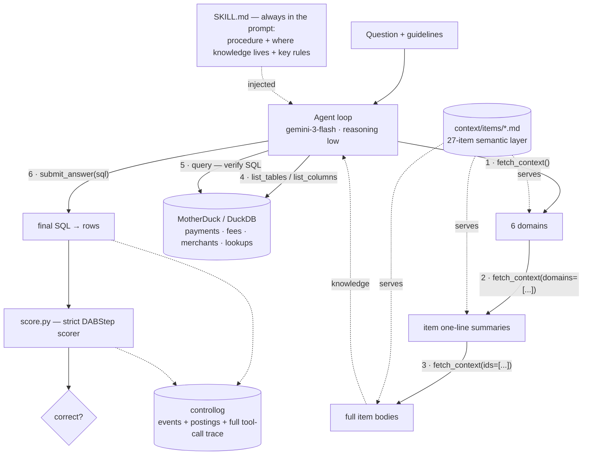
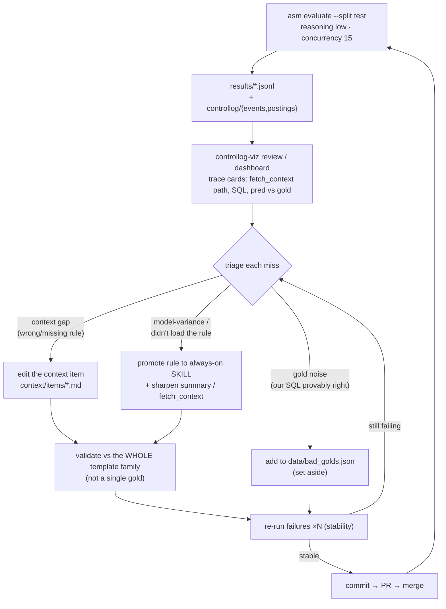

# How it works

Two loops: the **runtime** loop that answers a data question, and the **improvement**
loop that tunes the skill + context from the eval logs.

## 1. Answering a data question (runtime)

The agent always has the compact `SKILL.md` in its prompt; the heavy domain knowledge
is pulled on demand through `fetch_context` (progressive disclosure: domains →
one-line summaries → full bodies), then it explores the schema, verifies SQL, and
submits. `controllog` captures the full trace for later inspection.

## 2. Improving the system (from the logs)

Each eval writes per-question JSONL plus `controllog` events/postings.
`controllog-viz` renders trace cards (the `fetch_context` path the agent took, its
SQL, and predicted vs gold). Every miss is triaged into one of three buckets, fixed
at the **template-family** level (validated against *all* variations, not one gold),
re-run for stability, and merged.

**Core lesson from the tuning:** high-leverage rules must live in the *always-on*
`SKILL.md`, not only in fetch-gated context items — a low/no-reasoning model will skip
a rule it never loaded. See `docs/error-fixes.md` for the full per-template analysis.
