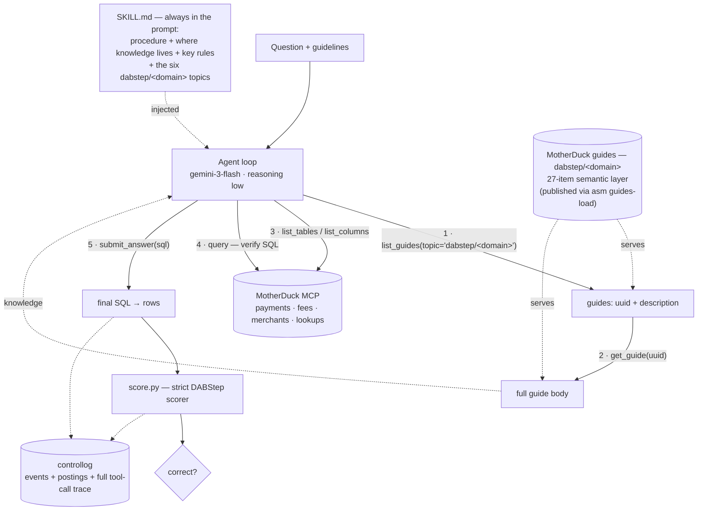
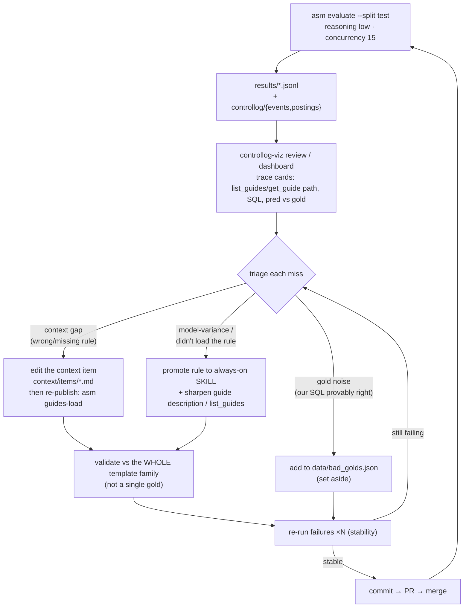

# How it works

Two loops: the **runtime** loop that answers a data question, and the **improvement**
loop that tunes the skill + context from the eval logs.

## 1. Answering a data question (runtime)

The agent always has the compact `SKILL.md` in its prompt; the heavy domain knowledge
is pulled on demand through the **MotherDuck context MCP server's guides** (topic/uuid
model: the six `dabstep/<domain>` topics are pre-seeded in the prompt, so the agent goes
straight to `list_guides(topic)` for a domain's guides + descriptions → `get_guide(uuid)`
for the full body), then it explores the schema and verifies SQL through the same MCP
server's data tools, and submits. `controllog` captures the full trace for later inspection.

## 2. Improving the system (from the logs)

Each eval writes per-question JSONL plus `controllog` events/postings.
`controllog-viz` renders trace cards (the `list_guides(topic)`/`get_guide(uuid)` path the
agent took, its SQL, and predicted vs gold). Every miss is triaged into one of three
buckets, fixed at the **template-family** level (validated against *all* variations,
not one gold), re-run for stability, and merged.

**Core lesson from the tuning:** high-leverage rules must live in the *always-on*
`SKILL.md`, not only in fetch-gated context items — a low/no-reasoning model will skip
a rule it never loaded. See `docs/error-fixes.md` for the full per-template analysis.
